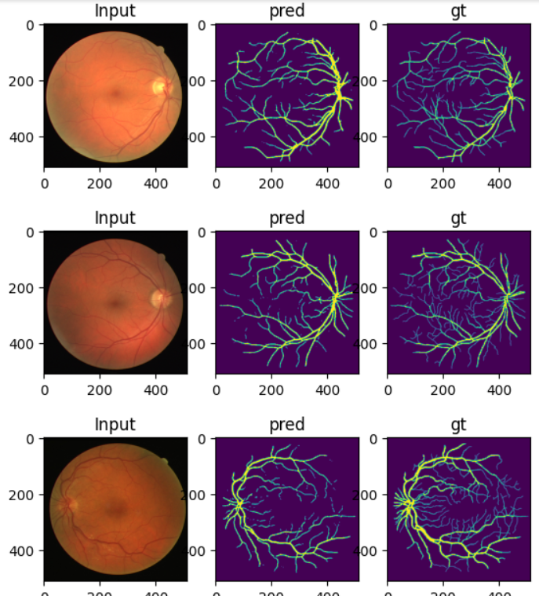

# Retinal Vessel Segmentation based on U-NET Algorithm



## **Overview**
This project focuses on segmenting **retinal blood vessels** from fundus images, a critical task in diagnosing and managing conditions like **diabetic retinopathy** and **glaucoma**. (More details laid out in the Presentation PDF)


---

## **Features**
- Implements **state-of-the-art segmentation model**.
- Supports **custom dataset training**.
- **Pretrained model weights** available for quick inference.

---

## **Dataset**
The project uses the [Kaggle Retina Blood Vessel Dataset](https://www.kaggle.com/datasets/abdallahwagih/retina-blood-vessel)

---

## **Requirements**
Ensure you have the following libraries and dependencies installed:

```plaintext
Python >= 3.8
PyTorch >= 1.11.0
NumPy
OpenCV
Matplotlib
Scikit-learn


